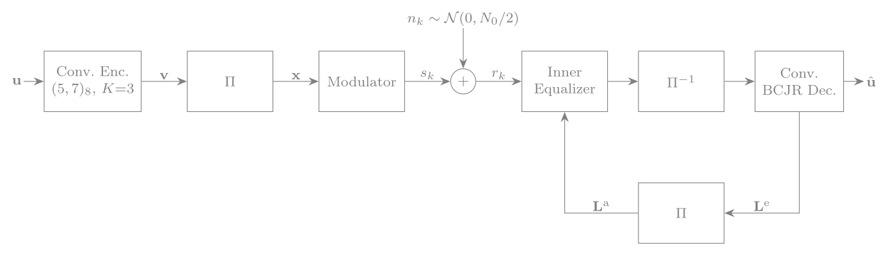
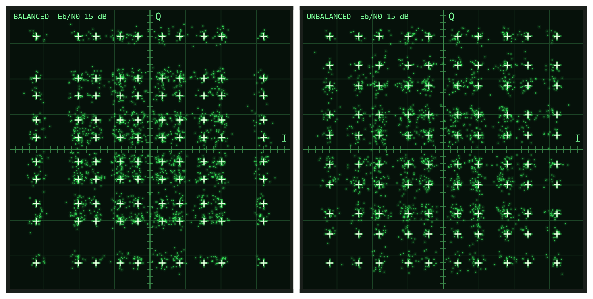
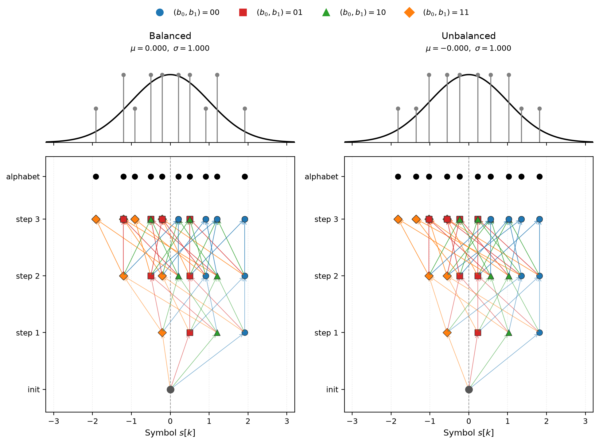
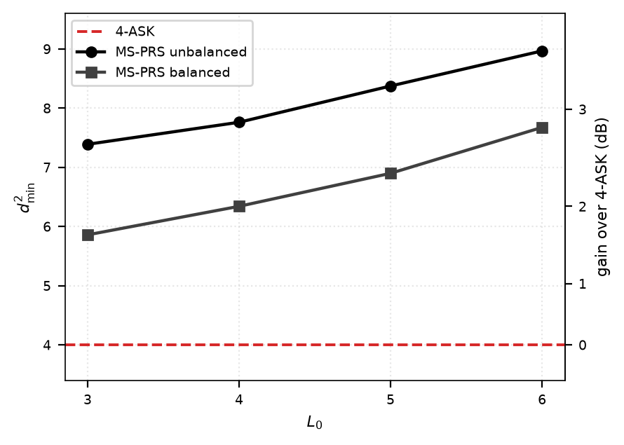
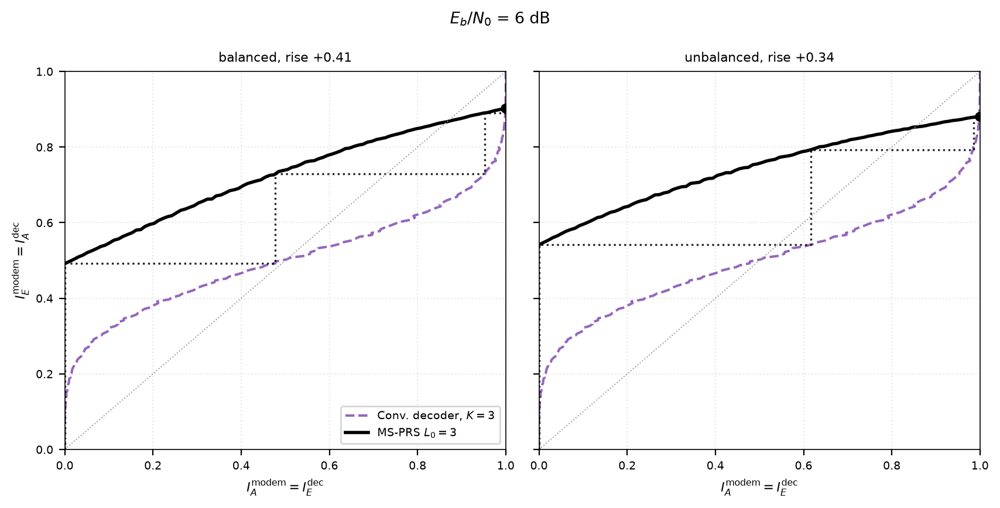

# Turbo-Equalized MS-PRS

**Multi-Stream Partial Response Signaling (MS-PRS)** is a modulation scheme at the Nyquist rate that adds controlled intersymbol interference through short FIR filters across two bipolar sub-streams, instead of compressing the symbol period the way faster-than-Nyquist signaling does. MS-PRS at Rate 2 carries two bits per channel use. This project uses [AFF3CT](https://github.com/aff3ct/aff3ct) for efficient BER simulations.

The chain the simulator runs: encode, interleave, modulate, then a receiver that passes extrinsic information between the equalizer and the decoder. The receiver is a turbo loop: a BCJR equalizer on the `2^(L0-1)`-state trellis trades log-likelihood ratios with a rate-1/2 convolutional or LDPC decoder.

<p align="center">
  
</p>

Received symbols on the I/Q plane, measured over the air between two ADALM-Pluto
radios at 15 dB. White crosses mark the ideal points; the scatter around them is
what the equalizer works with.

<p align="center">
  
</p>

Above, the symbol alphabet and how often each level occurs, against a Gaussian
of the same mean and variance. Below, the values reachable in three steps from
the all-zero state, coloured by the input pair that produced them.

<p align="center">
  
</p>

## Minimum Squared Euclidean Distance

The BER performance at high-SNR slope is set by `d2_min`. This is where the error-rate advantage
lives. Every design clears 4-ASK by 1.7 to 3.5 dB.

<p align="center">
  
</p>

## EXIT Chart

The equalizer's characteristic against the decoder's, mirrored. The gap
between them is the tunnel the turbo loop climbs.

<p align="center">
  
</p>


## Run It

Build the simulator, then run any mode:

```
cmake -S . -B build -DCMAKE_PREFIX_PATH="$PWD/.aff3ct/install"
cmake --build build -j

build/bin/msprs --mode coded-msprs --L0 3 --family balanced --iters 7
```

Full build steps and every mode are in [docs/build.md](docs/build.md);
conventions and the record format in [docs/reference.md](docs/reference.md).

The tap tables in [filters/](filters) are the single source of truth for both
filter families and every `L0`.

The notebooks read what the simulator writes and draw the figures above. They
compute nothing themselves:

```
python -m venv .venv && . .venv/bin/activate
pip install numpy matplotlib jupyter
jupyter lab notebooks/
```

## License

Apache 2.0, see [LICENSE](LICENSE). AFF3CT is a separate project under the
MIT licence.
